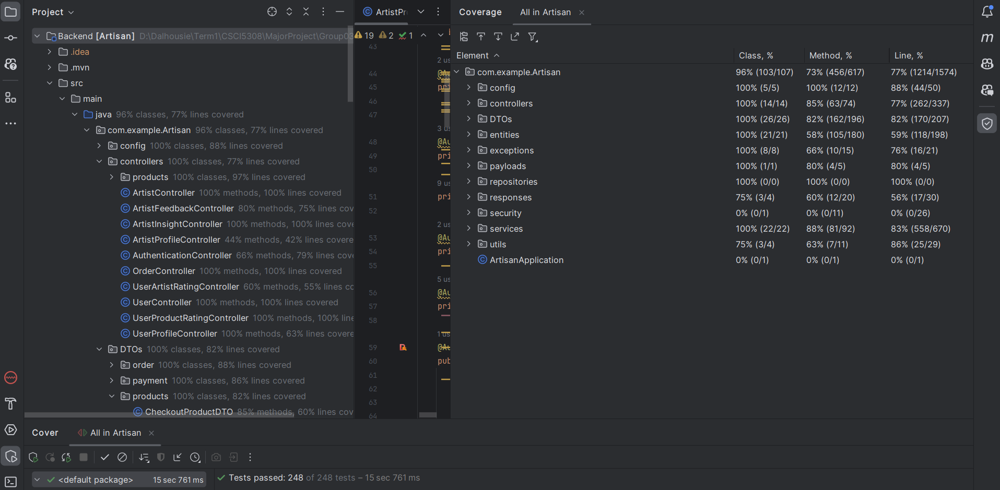

## Backend Documentation

The backend is built using Spring Boot and provides RESTful APIs to manage artists, products, orders, and more.

### Prerequisites for Backend

Before setting up the backend, ensure that you have Java installed on your system. The application requires JDK 21.

You can check your Java version by running:

```bash
java -version
```
If you dont have java please follow the installation guide
## Installation Guide

This guide covers the installation of Java JDK 21 and Maven on Windows and Linux operating systems.

### Installing Java JDK 21

#### For Windows:

1. Download the Java JDK 21 installer from the [Oracle website](https://www.oracle.com/java/technologies/javase-jdk21-downloads.html).
2. Execute the downloaded installer and follow the on-screen instructions.
3. Set the `JAVA_HOME` environment variable to your JDK installation path.
4. Update the `Path` system variable to include the JDK `bin` directory.

### Installing Maven

Download Apache Maven from the official Apache Maven project website.

Extract the downloaded archive to your desired location.
Add the Maven bin directory to your PATH environment variable.
Verify the installation by typing the following command in your terminal:
```bash
mvn -version
```

## Running the Application

Run the application locally using:

```bash
java -jar target/artisan-0.0.1-SNAPSHOT.jar
```
NOTE: Replace artisan-0.0.1-SNAPSHOT.jar with the actual JAR file name.


Alternatively, use Maven to run the application:

```bash
mvn spring-boot:run
```


### Dependencies
Artisan leverages various Maven dependencies for its functionality. Key dependencies include:

* **Spring Boot Starters**: For rapid application development, including spring-boot-starter-data-jpa, spring-boot-starter-validation, spring-boot-starter-web, and spring-boot-starter-security.
* **Database Connectivity**: mysql-connector-j for MySQL database connections.
* **Project Lombok**: org.projectlombok:lombok to minimize boilerplate code.
* **Spring Boot DevTools**: For development utilities.
* **ModelMapper**: org.modelmapper:modelmapper for object mapping.
* **Authentication and Authorization**: com.auth0:java-jwt for JWT handling.
* **API Documentation: org.springdoc**:springdoc-openapi-starter-webmvc-ui for OpenAPI documentation.
* **Email Service**: org.springframework.boot:spring-boot-starter-mail for email functionality.
* **Stripe Payment Integration**: com.stripe:stripe-java for handling payments.
* **Data Format**: com.google.code.gson:gson for JSON processing.

These dependencies are specified in the pom.xml file and will be automatically managed and installed by Maven.
## Controllers and API Endpoints

Artisan features several controllers, each handling different aspects of the application. Below is a table summarizing the primary API endpoints, their HTTP methods, and their purpose for each controller:

| Controller                  | Method | Endpoint                 | Description                                             |
|-----------------------------|--------|--------------------------|---------------------------------------------------------|
| `ArtistController`          | GET    | `/me`                    | Fetches the current artist's profile.                   |
|                             | GET    | `/all`                   | Retrieves all artists' profiles.                        |
| `ArtistFeedbackController`  | POST   | `/{artistId}/feedback`   | Submits feedback for a specific artist.                 |
|                             | GET    | `/{artistId}/rating`     | Gets the average rating of a specific artist.           |
|                             | GET    | `/{artistId}/feedback`   | Retrieves all feedback for a specific artist.           |
| `ArtistInsightController`   | GET    | `/sales`                 | Provides sales insights for the artist.                 |
| `ArtistProfileController`   | PUT    | `/details/{artistId}`    | Updates the details of an artist's profile.             |
|                             | POST   | `/profileImage`          | Uploads a profile image for the artist.                 |
|                             | DELETE | `/profileImage`          | Removes the artist's profile image.                     |
|                             | PUT    | `/story`                 | Updates the artist's story or biography.                |
|                             | POST   | `/story/images`          | Adds images to the artist's story.                      |
|                             | DELETE | `/story/images`          | Deletes images from the artist's story.                 |
| `AuthenticationController`  | POST   | `/user/register`         | Registers a new user account.                           |
|                             | POST   | `/user/login`            | Authenticates a user and issues a token.                |
|                             | POST   | `/user/forgot`           | Initiates a password reset process for users.           |
|                             | POST   | `/artist/register`       | Registers a new artist account.                         |
|                             | POST   | `/artist/login`          | Authenticates an artist and issues a token.             |
|                             | POST   | `/logout`                | Logs out the current user/artist and invalidates token. |
| `OrderController`           | POST   | `/checkout`              | Processes the checkout for a shopping cart.             |
|                             | POST   | `/complete-order`        | Completes an order process.                             |
|                             | GET    | `/history`               | Retrieves the order history of a user/artist.           |
| `UserController`            | GET    | `/test`                  | Endpoint for testing user-related operations.           |
|                             | GET    | `/me`                    | Fetches the profile of the current user.                |
| `UserProductRatingController`| POST  | `/{userId}/{productId}`  | Allows a user to rate a product.                        |
|                             | PUT    | `/{userId}/{productId}`  | Updates the rating for a product by a user.             |
|                             | DELETE | `/{userId}/{productId}`  | Removes a user's rating for a product.                  |
| `UserProfileController`     | PUT    | `/profileImage`          | Updates the profile image for a user.                   |
|                             | DELETE | `/profileImage`          | Deletes the profile image of a user.                    |
| `ProductCategoryController` | POST   | `/{categoryId}`          | Adds a new product category.                            |
|                             | GET    | `/{categoryId}`          | Retrieves details of a specific product category.       |
|                             | PUT    | `/{categoryId}`          | Updates a specific product category.                    |
|                             | DELETE | `/{categoryId}`          | Deletes a specific product category.                    |
| `ProductController`         | POST   | `/{id}`                  | Adds a new product under a category.                    |
|                             | GET    | `/{id}`                  | Fetches details of a specific product.                  |
|                             | PUT    | `/{id}`                  | Updates details of a specific product.                  |
|                             | DELETE | `/{id}`                  | Removes a specific product from the listing.            |
|                             | GET    | `/artist`                | Retrieves products created by the current artist.       |
|                             | GET    | `/artist/{id}`           | Fetches products created by a specific artist.          |
| `ProductInventoryController`| PUT    | `{productId}/inventory`  | Updates the inventory for a specific product.           |
|                             | GET    | `{productId}/inventory`  | Retrieves the inventory details for a specific product. |
| `ProductStoryController`    | POST   | `/story`                 | Adds a new story to a product.                           |
|                             | GET    | `/story`                 | Retrieves the story of a product.                        |
|                             | PUT    | `/story`                 | Updates the story of a product.                          |
|                             | DELETE | `/story`                 | Deletes the story of a product.                          |

These endpoints provide a comprehensive interface for interacting with the Artisan application, covering various functionalities like user and artist management, product catalog and inventory, orders, feedback, and more. Each endpoint serves a specific purpose, facilitating the operations necessary for the application's users and administrators.

# Testing

Execute the following command to run the unit tests:
```bash 
mvn test
```
The following table shows the overall test coverage of the backend application:

| Class % | Method % | Line % |
|---------|----------|--------|
| 96%     | 73%      | 77%    |


The follwing image shows the test coverage of the backend application:



[NAVIGATE BACK TO MAIN!!](../README.md)


