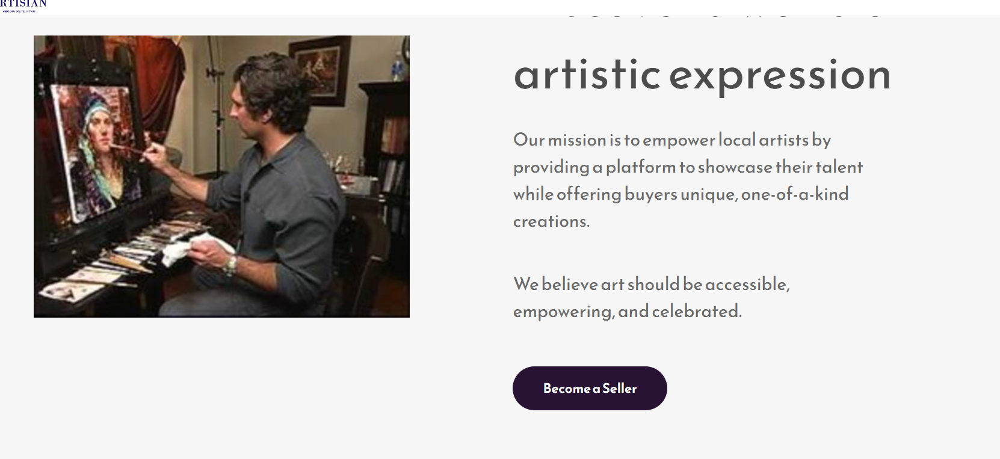
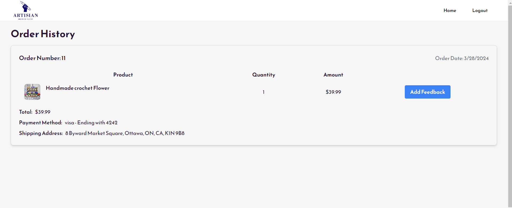

#   Artisan Marketplace 


###  Artisan Marketplace is an application where local artists can exhibit their expertise in traditional arts while sharing the stories behind their artwork and users can directly buy local traditional art 


## Frontend ( React JS )

#####   Dependencies 

*   react
*   raect-dom
*   react-icons
*   react-router-dom
*   react-scroll
*   react-simple-typewriter
*   react-toastify
*   recoil
*   axios
*   zod

#####   Dev Dependencies 

*   daisyui
*   tailwindcss
*   material-ui


## Build Documentation 

####    Pre-requisites

###  Install Node.js and NPM on Windows Machine 

To run the installation command, do the following:


1. Open the command prompt as an administrator.

2. Run the following command to install Node.js and NPM:

```
choco install nodejs

```


When prompted to run the installation script, press y and Enter to continue the installation. Wait for the installation to complete before proceeding.

3. Reset environment variables to add Node.js and NPM to PATH. Use the following command:

```
refreshenv

```


The command resets the environment variables, which enables running both programs from the terminal.

### Install Node On Ubuntu 18.04 and 16.04:

####  Install Node JS using Ubuntu official repository:

Node.js is available in Ubuntu’s repository and you can easily install it using a few commands. Follow the steps below to install Node.js on your Ubuntu operating system.

1.  Open your terminal or press Ctrl + Alt + T.


2.  To install node.js use the following command:

```
sudo apt install nodejs


```

 ### Step 2: Verify Node.js and NPM installation

To verify that Node.js is installed correctly, run the following command in a new command prompt session:

```
node -v

```


Check the NPM installation with:

```
npm -v

```

Both commands display the program version.


### How to start the frontend server?

1.  Clone the repository git clone https://git.cs.dal.ca/courses/2024-winter/csci5308/Group03.git
```
git clone https://git.cs.dal.ca/courses/2024-winter/csci5308/Group03.git

```
2.  Navigate to the cd Frontend.
```
cd Frontend

```
3.  Run npm install to install dependencies.
```
npm install

```
4.  Run npm run build to build the frontend.
```
npm run dev 

```

#   User Scenario:

##  The application supports two different types of users roles:

*   User: This role represents a person who interacts with the application as a regular user, typically browsing and purchasing products, viewing artist profiles, and accessing general features of the platform.


* Artist: This role represents individuals who create and showcase their art or products on the platform. Artists can manage their profiles, upload thier story behind the art, provide descriptions, and sell their creations to users.


##  Artist Scenario


### Artist Registration

1. **Objective:** The artist wants to register on the application to showcase their artworks.
2. **Action:** The artist navigates to the registration page and fills in the required information like First Name, Last Name,Email and Password
3. **Outcome:** After successful registration, the artist will be redirected to a artist profile  access to their profile, where they can add thier story ,and the story images 
4. **Benefits:** By registering, the artist can reach a wider audience, connect with art enthusiasts, and potentially sell their artworks online.




The registartion form looks this 


###  Artist Login

1. **Objective:** The artist intends to log in to the application to access their profile and manage their artworks, insights on sales and inventory  
2. **Action:** The artist navigates to the login page and enters their credentials (username and password).
3. **Outcome:** Upon successful login, the artist gains access to their artist  dashboard, where they can summaries the whole artist world 
4. **Benefits:** Logging in allows the artist to efficiently manage their art portfolio,  track thier sales, and mange thier inventory


###  Artist Dashboard Details

1. **Objective:** The artist wants to view detailed information about their dashboard, including the number of products, total sales, and the list of all products they have listed.
2. **Action:** The artist logs into their account and navigates to the dashboard section.
3. **Outcome:** In the dashboard, the artist can see the total number of products they have listed, the cumulative sales figures, and a comprehensive list of all their products with details.
4. **Benefits:** By having access to these dashboard details, the artist can track their performance, analyze product popularity, and make informed decisions to enhance their sales and visibility on the platform.


### Adding a Product
**Objective:** The artist aims to add a new product to their profile for sale.  
**Action:** The artist navigates to the "+" section and fills in the required details, including Product Name, Description, Price, and Quantity.  
**Outcome:** Upon successful submission, the new product is added to the artist's profile, visible to potential buyers.  
**Benefits:** Adding products enhances the artist's portfolio, increases visibility, and provides an opportunity to showcase and sell their artworks effectively.

Artist enters the following detils in the form  


Upon a success request product section looks like


###  Restoring a Recently Deleted Product

**Objective:** The artist wants to restore a recently deleted section to the active section of the page.

**Action:**

1. The artist navigates to the recently deleted section  was previously located.
2. The user looks for an option or feature that allows them to view deleted sections or restore deleted content.
3. Upon finding the restore option, the user selects the recently deleted section they wish to bring back.

**Outcome:** The recently deleted section is restored and becomes active on the page again, visible to users and accessible for further editing or interaction.

**Benefits:** This functionality enables users to recover accidentally deleted content, maintain continuity in the page layout, and avoid the need to recreate lost information from scratch.


Artist wants to restore the following product 


Upon a success request product section looks like


### Artist Profile 

**Objective:** The artist intends to enhance their profile by adding essential details and visual content.

**Action:**

1. The artist navigates to the profile settings section on the application.
2. The artist uploads a profile photo, writes about themselves in the "About Me" section, and specifies their city.
3. Additionally, the artist shares their story and uploads related images to showcase their journey and artworks.

**Outcome:** The artist's profile is updated with the new information, providing viewers with a comprehensive understanding of the artist's background, work, and inspirations.

**Benefits:** Updating the profile enriches the artist's online presence, engages potential clients with a personal touch, and showcases their artistic journey effectively.

Artist give the basic details regarding thier profile  


Artist give the basic details regarding thier story


### Artist Insights

**Objective:** The artist seeks insights into their sales and performance metrics for better decision-making.

**Action:**
1. The artist accesses the "Insights" section on the platform.
2. The platform presents graphs depicting sales by category, showcasing which types of products are most popular among buyers.
3. The artist views another graph showing the average ratings received for products in each category, aiding in understanding customer satisfaction levels.
4. Additionally, the platform provides a graph displaying monthly sales data for all years, highlighting sales trends over time.

**Outcome:** The artist gains valuable insights into their sales performance, category popularity, customer satisfaction, and seasonal sales patterns, enabling strategic planning and optimization of their art business.

**Benefits:** The insights empower the artist to make informed decisions, tailor their offerings based on customer preferences, identify areas for improvement, and maximize sales potential effectively.


The below images shows various types of graph supported  


1.  The below image show graph insights on sales


2.  The below image show graph insights on ratings 


3.  The below image show graph insights on monthly sales


##  User Scenario


###  User Registration and Login

1. **Objective:** The new user aims to create an account to become part of the art community and manage their artworks, sales, and inventory.
2. **Action:** The user navigates to the registration page where they provide required information, such as name, email, preferred username, password, and any other necessary details.
3. **Outcome:** Upon completing the registration form and submitting it, the user receives a confirmation email. After verifying their email address, the user's account is activated, granting access to their personal dashboard.
4. **Benefits:** Registering an account enables the user to showcase their artworks, track sales, and manage inventory, thus opening up opportunities for networking and business growth in the art world.


### User Dashboard 

1.  **Objective** Access the user dashboard to browse artists and view all available products.

2.  **Action**
*   Log in to the account.
*    Navigate to the user dashboard.
*   Browse artists and explore products.

3.  **Outcome**Efficiently discover new artists and artworks.


The below image shows all the products 


The below image shows all the artists 


###  View Artist Details (Learn more about them )

1. **Objective:** The user wants to view an artist's profile to learn more about the artist's background, view their artwork, and possibly purchase or inquire about the artworks.
2. **Action:** The user searches for the artist by name or browses through the artist directory on the platform. Upon finding the desired artist, the user clicks on the artist's profile link.
3. **Outcome:** The user is taken to the artist's profile page, which displays detailed information about the artist, including a biography, artistic style, a gallery of artworks, and contact or inquiry options.
4. **Benefits:** Checking out the artist's profile page allows the user to gain insights into the artist's work and background, facilitating an informed decision about purchasing art or initiating collaborations.


###  Checkout Product


1. **Objective:** The user wants to view detailed information about a specific artwork or product available on the art platform.
2. **Action:** The user navigates to the section of the website where products are displayed or uses the search function to find a particular artwork. Upon locating the desired product, the user clicks on its image or title to access the product page.
3. **Outcome:** The product page opens, displaying comprehensive details about the artwork, such as the artist’s name, description of the piece, dimensions, medium used, price, and availability. The page may also include high-resolution images of the artwork, customer reviews, and related products or artworks.
4. **Benefits:** Viewing the product page provides the user with essential information about the artwork, helping them make an informed decision regarding purchasing the item or learning more about the artist and their work.


###  Add Product to Cart

1. **Objective:** The user intends to purchase an artwork or product from the online art platform.
2. **Action:** The user browses the gallery or searches for a specific piece of art. Once they find the artwork they are interested in, they click on the product to view its details. After reviewing the artwork, including its price, description, and any other relevant details, the user adds the item to their shopping cart.
3. **Outcome:** The user navigates to the shopping cart, reviews their selected items, and proceeds to checkout. They enter their shipping and payment information, review the order summary, and then confirm the purchase.
4. **Benefits:** Completing the checkout process allows the user to acquire desired artwork, contributing to their collection or gifting needs, while supporting artists and the art community financially.


###  Order Payment

1. **Objective:** The user wants to securely complete the payment for their art purchases using Stripe as the payment platform.
2. **Action:** The user adds the desired artwork to their cart and proceeds to checkout. At the payment step, they select Stripe as their payment method, which prompts them to enter their payment details (e.g., credit card information) in the secure Stripe payment gateway interface.
3. **Outcome:** After the user enters their payment details and confirms the transaction, Stripe processes the payment and provides an immediate response regarding the success or failure of the transaction. Upon successful payment, the user receives a confirmation of their order and payment through email or on the website.
4. **Benefits:** Using Stripe for payments ensures a secure and smooth transaction process for the user. It provides them with a trustworthy and efficient way to pay for their art purchases, reduces the risk of fraud, and enhances the overall purchasing experience with quick and reliable payment processing.


### Order Tracking and Feedback

1.  **Objective**The system aims to track past orders made by users and provide feedback to artists regarding their products.

2.   **Action** Upon completing a purchase, the system records the order details, including the artwork, quantity, and payment information.  Users can  prompted to provide feedback or ratings for the purchased artwork to both art as well as artist

3.  **Outcome** After completing a purchase, users can access a summary of their past orders, including details such as the purchased artwork, quantities, and payment information. Additionally, users have the opportunity to provide feedback or ratings for the purchased artwork, which is visible to both other users browsing the product and the respective artist. This feedback mechanism fosters transparency and allows users to make informed decisions based on the experiences shared by others.

4.  **Benefits**
* **Enhanced User Experience:** Users can make more informed purchasing decisions by reviewing feedback from other users before making a purchase.
* **Transparent Feedback System:** The platform provides a transparent feedback system where users can share their experiences and opinions on purchased artworks, contributing to a more interactive and engaging environment.
* **Improved Product Quality:** Artists receive valuable feedback from users, enabling them to improve the quality of their artworks based on user preferences and suggestions.
* **Community Engagement:** The feedback system encourages community engagement and collaboration, fostering a sense of community among users and artists.




[NAVIGATE BACK TO MAIN!!](../README.md)


