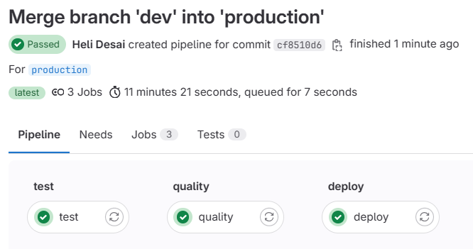

  # Artistan Marketplace

This repository contains the code for the Artist Marketplace, a platform where artists can list items and users can buy them. The project is split into two main sections: the backend (Spring Boot) and the frontend (React).

## Getting Started

These instructions will get you a copy of the project up and running on your local machine for development and testing purposes.

### Prerequisites

What things you need to install the software and how to install them:

- JDK 21
- Maven (for backend)
- React and npm (for frontend)

## Backend

The backend is built using Spring Boot and provides RESTful APIs to manage artists, products, orders, and more.

### Navigating to the Backend Section

The backend code is located in the `backend` directory.
```shell
cd Backend
```
For further details, refer to the 
[Backend Documentation](Backend/README.md)

## Frontend


### Navigating to the Frontend Section

The backend code is located in the `frontend` directory.
```shell
cd Frontend
```
For further details, refer to the
[Frontend Documentation](Frontend/README.md)

## Deployment

### Java Spring Boot Application Deployment

The application is containerized using a multi-stage Docker build process:

#### Stage 1: Build the Application

- `FROM openjdk:17-slim AS build`: Start with a slim OpenJDK 17 base image for building the application.
- `WORKDIR /app`: Set the working directory inside the container.
- `COPY .mvn/ .mvn`: Copy the Maven wrapper directory into the container.
- `COPY mvnw pom.xml ./`: Copy the Maven wrapper executable and `pom.xml` file.
- `RUN chmod +x ./mvnw`: Make the Maven wrapper script executable.
- `RUN ./mvnw dependency:go-offline`: Fetch all dependencies to be cached.
- `COPY src src`: Copy the actual source code of the application into the container.
- `RUN ./mvnw package -DskipTests`: Package the application into a JAR, skipping tests.

#### Stage 2: Create the Final Image

- `FROM openjdk:17`: Use OpenJDK 17 for the runtime image.
- `WORKDIR /app`: Set the working directory in the runtime container.
- `COPY --from=build /app/target/*.jar app.jar`: Copy the JAR file from the build stage.
- `EXPOSE 8080`: Expose port 8080 which the application uses.
- `CMD ["java", "-jar", "app.jar"]`: Define the command to run the application.

To build and run the container:

```bash
docker build -t artisan-app .
docker run -p 8080:8080 artisan-app
``` 


### Node.js Application Dockerfile

The `Dockerfile` for the Node.js application is set up for a two-phase process: building and running the application.

#### Stage 1: Build the application
```Dockerfile

FROM node:20-alpine
WORKDIR /app
COPY package.json .
RUN npm install
COPY . .
RUN npm run build
```
#### Stage 2: Run the application
```Dockerfile
EXPOSE 8080
CMD ["npm", "run", "preview", "--", "--host"]
```

## GitLab CI/CD Pipeline Configuration

The project uses GitLab CI/CD to automate the testing, quality analysis, and deployment of the application.



This `gitlab-ci.yml` file defines a GitLab CI/CD pipeline with three stages: `test`, `quality`, and `deploy`.

### `test` Stage

- **Image Used**: `maven:latest`
- **Script Actions**:
    - Change directory to `Backend`.
    - Execute `mvn test` to run the unit tests.
- **Execution Condition**: This stage runs only on the `production` branch.

### `quality` Stage

- **Image Used**: `openjdk:17-jdk-alpine`
- **Script Actions**:
    - Display a message "Extracting the smells...".
    - Create a directory named `smells`.
    - Run `java -jar DesigniteJava.jar -i Backend` to analyze code quality.
- **Execution Condition**: Runs only on the `production` branch.

### `deploy` Stage

- **Image Used**: `kroniak/ssh-client`
- **Script Actions**:
    - Set file permissions for the SSH private key.
    - Establish SSH connections and clean the `DEPLOYMENT` directory on the remote server.
    - Create a new `DEPLOYMENT` directory on the remote server.
    - Securely copy project files to the `DEPLOYMENT` directory on the remote server.
    - Copy the `.env` file and frontend environment variable file to the remote server's `DEPLOYMENT` directory.
    - Execute the `startup.sh` script on the remote server to start the application.
- **Execution Condition**: Triggered only for the `production` branch.
- **Dependencies**: Depends on the successful completion of the `test` stage.

This pipeline ensures that code is tested, analyzed for quality, and then deployed to the production environment in an automated manner.
